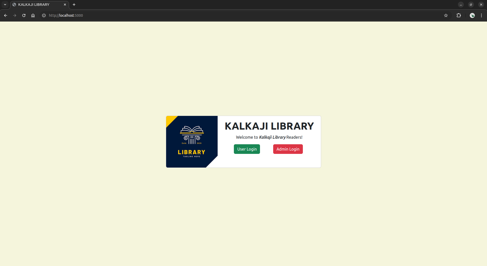
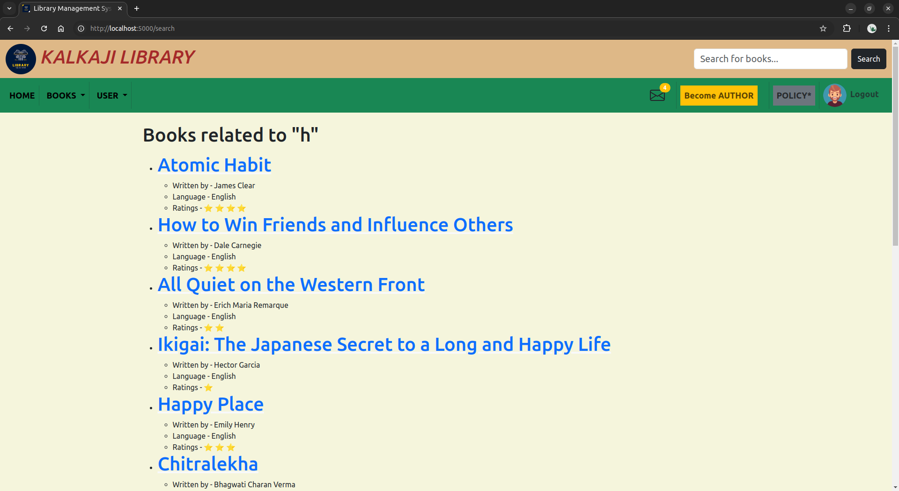

# KALKAJI LIBRARY #

# Website Live at
```
http://env-from-cli-bish.eba-cdjd3vis.ap-south-1.elasticbeanstalk.com/
```

# About Project
- This project is about an Online Library Management System.
- There will be one admin and many users.
- Users can sign-up/register and can start reading books or issue e-books.
- Admin can perform CRUD Operations on Section and Books and handle incoming book-requests.


# Project Approach
- Developing a user-friendly and aesthetically pleasing online library website.
- Implement user profiles, including general user profiles and admin specific functionality.


## Screenshots
<div style="width: 100%;display: inline-block">
   
   
   
   
   
   
   
   
   
   
   
   
   
</div>


# Technology Stack

The following technologies and tools are used in order to develop this website:
- Flask: for application code, to handle user requests, manage routing, and creating web pages.
- Flask-SQLAlchemy: for interaction with database. 
- Flask-Bcrypt: for hashing password.
- Jinja2: templating engine to generate dynamic HTML content. It allows me to combine python code with HTML templates.
- Bootstrap: for quick css styling and aesthetics.


# How to run this project
- Firstly Create Virtual Environment.
``` python3 -m venv .env ```
- After creating the .env file invoke the venv.
``` source .env/bin/activate ```

- Now install all the dependices needed in order to run this project
- All the required modules are in requirements.txt file
- We will use pip to install
``` pip install -r requirements.txt ```

- After installing all the modules we are ready to run the flask project.
``` python app.py ```
- The web-page will be servered on localhost port 5000.


# Project Structure

```zsh
$ tree
.
├── api
│   ├── book_api.py
│   └── section_api.py
├── app.py
├── controllers
│   ├── admin.py
│   ├── books.py
│   ├── enrollments.py
│   ├── index.py
│   ├── issue_book.py
│   ├── section.py
│   └── user.py
├── dbschema.pdf
├── Dockerfile
├── download
│   └── Atomic Habit.pdf
├── instance
│   └── books.sqlite3
├── Mad-1 Project Report.docx
├── Mad-1 Project Report.pdf
├── migrations
│   ├── alembic.ini
│   ├── env.py
│   ├── README
│   ├── script.py.mako
│   └── versions
│       ├── 1ecfbaf16ed2_.py
│       ├── 21c69c5f8bbe_.py
│       ├── 27e9e4d82435_.py
│       ├── 35051d041b1a_.py
│       ├── 356fa251c895_added_book_id_to_message_class.py
│       ├── 3dd1b673a582_.py
│       ├── 3e0966bc2c05_.py
│       ├── 5d259d2d2704_.py
│       ├── 83f5d5a69e67_.py
│       ├── 84a8d9752293_.py
│       ├── 884450b5da67_.py
│       ├── 92a4c0c6e11b_.py
│       ├── 9a1429da0f4f_.py
│       ├── bf2954592306_.py
│       ├── dbdf5b6028f5_.py
│       └── dc8d878f052f_req_days_can_t_be_null.py
├── models
│   └── model.py
├── openapi.yaml
├── Readme.md
├── requirements.txt
├── screenshots
│   ├── screen10.png
│   ├── screen11.png
│   ├── screen12.png
│   ├── screen13.png
│   ├── screen1.png
│   ├── screen2.png
│   ├── screen3.png
│   ├── screen4.png
│   ├── screen5.png
│   ├── screen6.png
│   ├── screen7.png
│   ├── screen8.png
│   └── screen9.png
├── static
│   ├── admin.png
│   ├── book1.jpeg
│   ├── book2.jpeg
│   ├── book3.jpeg
│   ├── book4.jpeg
│   ├── book5.jpeg
│   ├── book6.jpeg
│   ├── D_2NwfYWwAIUE8A.png
│   ├── dashboard_chart.png
│   ├── global.css
│   ├── library.png
│   ├── logo_lib.jpeg
│   ├── rating.png
│   ├── section.png
│   └── user.png
└── templates
    ├── 404page.html
    ├── admin
    │   ├── add-section.html
    │   ├── admin_login.html
    │   ├── all_books.html
    │   ├── category.html
    │   ├── dashboard.html
    │   ├── enrolls.html
    │   ├── layout.html
    │   ├── new_book.html
    │   ├── requests.html
    │   ├── update.html
    │   ├── user_details.html
    │   ├── users.html
    │   └── view.html
    ├── author.html
    ├── base.html
    ├── book_id
    │   └── <int:id>.html
    ├── download.html
    ├── first_page.html
    ├── footer.html
    ├── genre.html
    ├── index.html
    ├── issue_book.html
    ├── language.html
    ├── message.html
    ├── mybook.html
    ├── policy.html
    ├── profile
    │   ├── profile.html
    │   └── update.html
    ├── search.html
    ├── section
    │   ├── <int:id>.html
    │   └── view
    │       └── <int:id>.html
    ├── show
    │   └── <int:id>.html
    ├── user_login.html
    └── user_signup.html

17 directories, 103 files
```

## Deployed using AWS EB.
# Documentation
Ranjeet Sharma (21f2001119)
